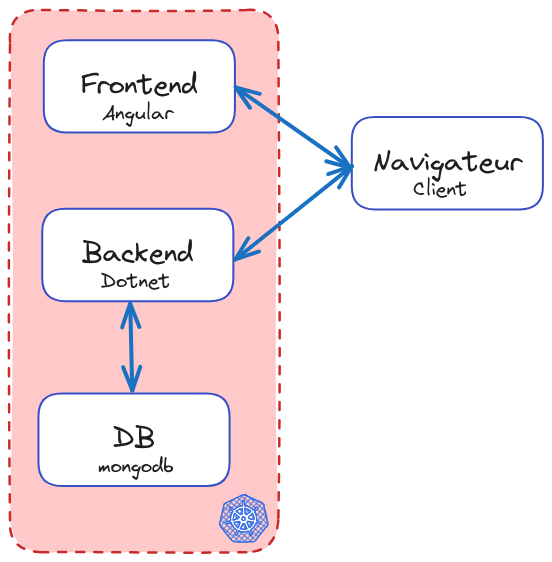

# Démo d'exemple

Il est en lien avec les formations sur les **Container Engines (Docker / Podman)** présentes sur le Drive.  

## Architecture
Application TODO List en 3 tiers:  

## Contenu
Projet qui porte:
- Une application frontend en angular
- Une application backend en Golang

Chaque projet porte un fichier Dockerfile et un script pour builder l'image.  

## Objectif
Il est utilisé pour la formation Docker et Kubernetes.  

**Formation Docker:**
Un fichier *docker-compose.yml* vide est présent pour l'exercice de la formation Docker.  

**Formation Kubernetes:**  
L'appli frontend doit être builder avec un base-href différent pour chaque étudiant, permmetant un routage différent au niveau ingress. ([script](https://github.com/Les-filles-et-les-garcons-de-la-tech/todo-list-docker-compose-example/blob/master/Front/frontend/build-and-push.sh)).

