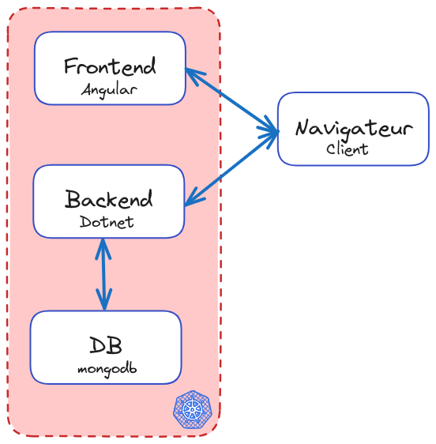

# Démo d'exemple

## Architecture
Application TODO List en 3 tiers:  

## Contenu
Projet qui porte:
- Une application frontend en angular
- Une application backend en Dotnet

Chaque projet porte un fichier Dockerfile et un script pour builder l'image.  

Un fichier docker-compose.yaml vide est présent pour l'exercice de la formation Docker.  

L'appli frontend doit être builder avec un base-href différent pour l'environnement de la formation Kubernetes ([script](https://github.com/Les-filles-et-les-garcons-de-la-tech/todo-list-docker-compose-example/blob/master/Front/frontend/build-and-push.sh)).

